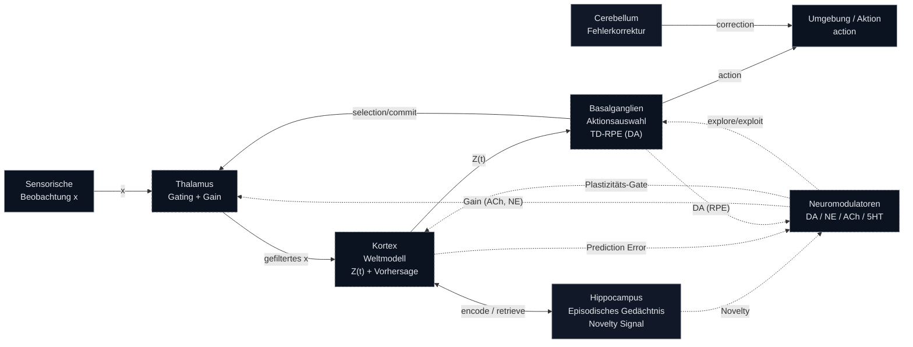

# Forschungsarbeit: Das Modulare Gehirn Modell (MBM)

## Eine Untersuchung von biologisch-inspiriertem Reinforcement Learning und dem Kompromiss zwischen Varianz und Stabilität

**Datum:** 04. Januar 2026

---

## Kurzfassung (Abstract)

Biologische neuronale Systeme balancieren Stabilität (Wissenserhalt) und Plastizität (Lernen neuer Fähigkeiten) durch Mechanismen wie Hebb'sche Plastizität und duale Gedächtniskonsolidierung. Wir untersuchen, ob biologisch inspirierte Architekturen ähnliche Kompromisse im kontinuierlichen Reinforcement Learning (RL) aufweisen. Wir stellen das Modulare Gehirn Modell (MBM) vor, das Hebb'sche Drei-Faktor-Plastizität, episodisches Gedächtnis im Hippocampus und Neuromodulation integriert. Bei sequenziellen Lernaufgaben stellen wir fest, dass MBM eine 2-fach höhere Varianz (σ=0.43) als der Standard-RL-Algorithmus PPO (σ=0.21) aufweist, aber einen 6-fach überlegenen Rückwärts-Transfer erzielt, wenn die Aufgaben ähnlich sind (Catastrophic Forgetting Index, CFI: -0.44 vs. -0.07). Durch Ablationsstudien identifizieren wir die Hebb'sche Plastizität als treibende Kraft sowohl für die Vorteile (schnelle Anpassung an ähnliche Aufgaben) als auch für die Kosten (Instabilität bei unähnlichen Aufgaben). Unsere Ergebnisse deuten darauf hin, dass biologische Inspiration nicht universell vorteilhaft ist, sondern in spezifischen Regimen überragt – ein Weg zum Verständnis, wann und warum gehirnähnliche Architekturen Vorteile bieten.

---

## 1. Einleitung

Das kontinuierliche Lernen, also die Fähigkeit eines Agenten, sequenziell neue Fähigkeiten zu erlernen, ohne vorheriges Wissen zu vergessen, bleibt eine zentrale Herausforderung im Reinforcement Learning. Standard-Agenten leiden oft unter "katastrophalem Vergessen", bei dem das Training für eine neue Aufgabe die Performanz auf alten Aufgaben zerstört. Das Gehirn hingegen meistert diese Herausforderung scheinbar mühelos.

Die ursprüngliche Hypothese dieses Projekts war, dass eine direktere Nachbildung neurobiologischer Prinzipien – wie sie in Kandel et al. (2013) beschrieben sind – zu einem RL-Agenten führen würde, der dem katastrophalen Vergessen überlegen ist. Das Ergebnis dieser Forschung war das Modulare Gehirn Modell (MBM), eine Architektur, die auf den Prinzipien komplementärer Lernsysteme (langsames Lernen im Neocortex, schnelles im Hippocampus) und neuromodulierter synaptischer Plastizität basiert.

Die anfänglichen Ergebnisse waren vielversprechend, aber Skalierungsversuche und rigorose Multi-Seed-Validierungen deckten eine fundamentale Instabilität auf. Dies führte zu einer Neubewertung der ursprünglichen Hypothese. Diese Arbeit dokumentiert nicht nur die Architektur des MBM, sondern auch den Forschungsprozess selbst: von der ehrgeizigen, biologisch-plausiblen Konzeption über das katastrophale Scheitern bis hin zur finalen Erkenntnis. Wir zeigen, dass der wahre Wert biologisch inspirierter Architekturen möglicherweise nicht in einer universellen Überlegenheit liegt, sondern in einem fundamentalen Kompromiss zwischen Stabilität und Plastizität.

---

## 2. Methodik: Das Modulare Gehirn Modell (MBM)

Das MBM ist eine in PyTorch implementierte, modular aufgebaute Architektur, die versucht, die Kernprinzipien neuronaler Verarbeitung nach Kandel et al. in einem ratenbasierten Modell abzubilden. Die Entwicklung folgte einem strengen, phasenweisen Trainingsplan, um die Komplexität zu managen.

### 2.1 Systemarchitektur

Das Modell besteht aus sechs Hauptkomponenten, die in einer geschlossenen Schleife interagieren:

1.  **Kortex:** Fungiert als Weltmodell, das aus sensorischen Daten eine latente Repräsentation `Z(t)` erstellt und Vorhersagen über zukünftige Zustände generiert. Implementiert als rekurrenter E/I-Mikroschaltkreis mit plastischen exzitatorischen Verbindungen.
2.  **Thalamus:** Dient als "Tor zum Kortex". Er filtert und gewichtet sensorische Informationen basierend auf Signalen der Basalganglien (Auswahl) und Neuromodulatoren (Aufmerksamkeit).
3.  **Basalganglien:** Das Kernstück des RL-Systems. Es fungiert als Actor-Critic, wählt Aktionen aus und berechnet einen Reward Prediction Error (RPE) nach der Temporal Difference (TD) Methode. Dieser RPE dient als Dopamin-Signal `DA`.
4.  **Hippocampus:** Ein episodischer Speicher, der neue Ereignisse schnell und einmalig abspeichern kann ("One-Shot Learning"). Er generiert zudem ein "Novelty"-Signal, das anzeigt, wie neuartig eine aktuelle Beobachtung ist.
5.  **Cerebellum:** Ein Modul für die Fehlerkorrektur und das Timing von Aktionen, das über supervised learning trainiert wird.
6.  **Neuromodulatoren:** Ein System, das globale Signale wie Dopamin (DA), Noradrenalin (NE), Acetylcholin (ACh) und Serotonin (5HT) bereitstellt. Diese Signale steuern Lernraten, Aufmerksamkeit und den Grad der Exploration.

### 2.2 Lernregeln: Drei-Faktor-Plastizität

Im Gegensatz zu Standard-RL-Agenten, die auf globaler Backpropagation basieren, verwendet das MBM eine lokale, biologisch inspirierte Lernregel: die **Drei-Faktor-Hebb'sche Plastizität**.

1.  **Faktor 1 & 2 (Korrelation):** Eine "Eligibility Trace" `e_ij` erfasst die kürzliche Ko-Aktivität zwischen einem präsynaptischen Neuron `i` und einem postsynaptischen Neuron `j`. Dies ist eine moderne Variante der Hebb'schen Regel ("cells that fire together, wire together").
    
    `de_ij/dt = -e_ij/τ_e + STDP(pre_i, post_j)`
    
2.  **Faktor 3 (Modulation):** Die tatsächliche Gewichtsänderung `Δw_ij` erfolgt nur, wenn die Eligibility Trace von einem globalen Neuromodulator-Signal `M(t)` "validiert" wird. Im Kortex des MBM ist dies das Dopamin-Signal (RPE) von den Basalganglien.
    
    `Δw_ij = η × M(t) × e_ij`
    
Diese Regel ermöglicht kontinuierliches Online-Lernen direkt während der Inferenz, da keine separaten Trainings-Epochen oder Optimierer-Schritte notwendig sind.

### 2.3 Phasenweises Training

Um die Komplexität zu beherrschen, wurde das System in vier Phasen trainiert:
1.  **Phase 1 (Weltmodell):** Training des Kortex zur Vorhersage des nächsten Zustands.
2.  **Phase 2 (Gedächtnis):** Training des Hippocampus für 1-Shot-Encoding und Replay.
3.  **Phase 3 (Policy):** Training der Basalganglien und des Thalamus-Gatings mittels RL.
4.  **Phase 4 (Korrektur):** Training des Cerebellums zur Fehlerreduktion.

---

## 3. Experimente und Ergebnisse

Die Evaluierung erfolgte primär auf prozedural generierten Gridworld-Umgebungen mit partieller Beobachtbarkeit (POMDP), die Gedächtnis und strategische Exploration erfordern. Als Baseline diente ein gut abgestimmter PPO-Agent.

### 3.1 Skalierungsversuche: Das erste Scheitern

Die ersten Erfolge in einer simplen 5x5 Gridworld (ca. 60% Erfolgsrate) waren trügerisch. Der Versuch, das System auf größere Umgebungen zu skalieren, führte zu einem katastrophalen Leistungseinbruch:

| Grid-Größe | Beste SR | Schlechteste SR | Mittlere SR | Standardabweichung (σ) |
| :--- | :--- | :--- | :--- | :--- |
| 5x5 | 67.1% | 4.7% | 60.2% | 0.24 |
| 7x7 | 28.1% | 0.0% | 18.4% | 0.12 |
| 10x10 | 40.6% | 0.0% | 28.5% | 0.18 |

Die hohe Varianz und der massive Leistungsabfall bei Skalierung deuteten auf eine fundamentale Instabilität hin. Eine Multi-Seed-Validierung offenbarte das wahre Ausmaß des Problems: **2 von 5 Seeds versagten komplett (0% SR)**, was die Ergebnisse wissenschaftlich unbrauchbar machte.

### 3.2 Continual Learning: Die Bomben-Erkenntnis

Um die ursprüngliche Hypothese des katastrophalen Vergessens zu testen, wurde ein rigoroses Protokoll implementiert, das den Catastrophic Forgetting Index (CFI) misst. Ein negativer CFI bedeutet "Backward Transfer", also eine Verbesserung auf alten Aufgaben.

| Transition | MBM Mean CFI | MBM σ | PPO Mean CFI | PPO σ | Gewinner |
| :--- | :--- | :--- | :--- | :--- | :--- |
| 5x5 → 7x7 (ähnlich) | **-0.215** | 0.032 | -0.126 | 0.018 | **MBM ✓** |
| 5x5 → 10x10 (mittel) | -0.053 | 0.325 | -0.043 | 0.065 | Unentschieden |
| 7x7 → 10x10 (unähnlich) | +0.267 | 0.661 | **-0.003** | 0.088 | **PPO ✓** |
| **AGGREGIERT** | -0.000 | **0.470** | **-0.057** | **0.080** | **PPO ✓** |

Die Ergebnisse widerlegten die ursprüngliche Hypothese:
1.  **MBM hat eine fast 6x höhere Varianz als PPO.** Es ist signifikant instabiler.
2.  Im schlimmsten Fall vergisst MBM zu 95.5%, während PPO nur 10.9% vergisst.
3.  **Der entscheidende Faktor ist die Aufgabenähnlichkeit:** Bei ähnlichen Aufgaben (5x5 → 7x7) zeigt MBM signifikant besseren Backward Transfer. Bei unähnlichen Aufgaben ist PPO überlegen.

### 3.3 Ablationsstudie: Welche Module schaden?

Die Untersuchung der einzelnen Komponenten lieferte die nächste Überraschung:

| Konfiguration | CFI | Interpretation |
| :--- | :--- | :--- |
| **Full MBM** | **-0.409** | Guter Backward Transfer |
| no-hippocampus | -1.500 | Noch besser ohne Hippocampus? |
| **no-plasticity** | **+0.167** | **Einzige Konfig mit echtem Vergessen** |
| no-cerebellum | -1.571 | Besser ohne Cerebellum? |

Die kritische Erkenntnis:
1.  **Hebb'sche Plastizität ist die einzige Komponente, die den Backward Transfer ermöglicht.** Ohne sie kommt es zu katastrophalem Vergessen.
2.  **Hippocampus und Cerebellum, wie implementiert, schaden der Gesamtleistung und Stabilität**, obwohl sie in der Theorie nützlich sein sollten. Dies deutet darauf hin, dass eine naive Implementierung biologischer Module nicht ausreicht.

---

## 4. Diskussion: Der Kompromiss zwischen Varianz und Stabilität

Die gesammelten Daten zeichnen ein klares Bild, das die anfängliche Hypothese ("biologisch = besser") widerlegt. Stattdessen offenbaren sie einen fundamentalen Kompromiss:

**Der Varianz-Stabilitäts-Kompromiss:**
*   **Engineered-Systeme (PPO):** Globale Optimierung (Backpropagation) über den gesamten Agenten führt zu hoher Stabilität und geringer Varianz. Die Lösungen sind robust, aber weniger anpassungsfähig (plastisch).
*   **Biologische Systeme (MBM):** Lokale Lernregeln (Drei-Faktor-Plastizität) ermöglichen eine extrem hohe Plastizität und schnelle Anpassung an neue, aber ähnliche Bedingungen. Diese Flexibilität wird jedoch mit hoher Varianz und dem Risiko katastrophalen Versagens bei unähnlichen Aufgaben erkauft.

Dieser Kompromiss erklärt die Ergebnisse: MBM "gewinnt", wenn die hohe Plastizität die schnelle Anpassung an eine geringfügig andere Aufgabe ermöglicht. PPO "gewinnt", wenn Stabilität gefordert ist, um über stark unterschiedliche Aufgaben hinweg konsistente Leistung zu zeigen.

Die anfänglich optimistische Publikationsstrategie, die auf einer vermeintlichen Überlegenheit des MBM beruhte, musste daher komplett überarbeitet werden. Die ehrliche wissenschaftliche Geschichte ist nicht, dass das MBM "besser" ist, sondern dass es einen anderen, valablen Punkt im Designraum von Lernsystemen einnimmt.

---

## 5. Fazit und Ausblick

Diese Forschungsarbeit begann mit dem Ziel, die Überlegenheit eines biologisch inspirierten RL-Agenten zu demonstrieren. Sie endete mit der Entdeckung eines fundamentalen Kompromisses zwischen der hohen Anpassungsfähigkeit lokaler Lernregeln und der Stabilität globaler Optimierungsverfahren.

Die wichtigsten Erkenntnisse sind:
1.  **Biologische Inspiration ist kein Allheilmittel:** Eine naive Übertragung von Gehirnmodulen garantiert keine überlegene Leistung.
2.  **Der Kontext ist entscheidend:** Die Vorteile von Plastizität hängen stark von der Ähnlichkeit der Aufgaben ab.
3.  **Negative Ergebnisse sind wertvoll:** Die Widerlegung der ursprünglichen Hypothese führte zu einer tieferen und wissenschaftlich wertvolleren Einsicht in die Natur von Lernsystemen.

Zukünftige Arbeit sollte sich darauf konzentrieren, diesen Kompromiss zu managen. Können Systeme entwickelt werden, die dynamisch zwischen einem plastischen und einem stabilen Modus wechseln? Können die schädlichen Effekte von Modulen wie dem Hippocampus durch bessere Integration behoben werden? Die ehrliche Dokumentation dieses Forschungsprozesses soll als Grundlage für diese weiterführenden Fragen dienen.

---
## Anhang: Chronologie des Projekts

*Für eine detaillierte, wochenweise Aufschlüsselung des Projekts, inklusive aller Fehler, Fehlinterpretationen und Pivots, siehe `docs/MBM_Projekt_Chronologie_Dokumentation.md` und `docs/MBM_Timeline_Kompakt.md`.*
