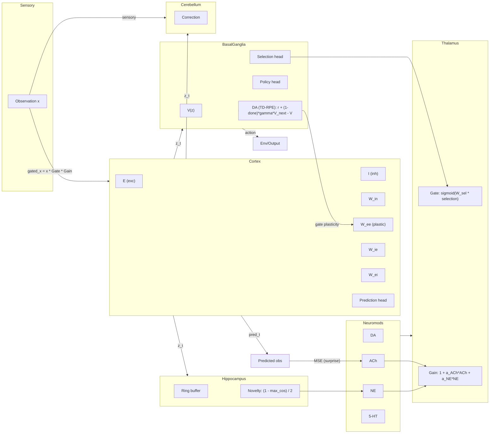

# Modular Brain Model (MBM) – Research Exposition

Below is a research-style exposition of the Modular Brain Model (MBM) grounded in the repository, with a mermaid architecture diagram, detailed discussion of components, learning rules, and trade-offs. Citations point to the inspected source files.
## Abstract
The Modular Brain Model (MBM) is a closed-loop, neuro-inspired control architecture that integrates perception, prediction, action selection, episodic memory, and neuromodulatory learning. The system replaces global backpropagation with local, three-factor plasticity, enabling online adaptation during inference. This paper details its module-level design, mathematical formulation, and learning dynamics, and contrasts it with gradient-based monolithic architectures such as GPT-style transformers. Strengths include continual adaptation, sparse and goal-directed perception, and explicit action loops; weaknesses include limited expressivity of simple rate-based units, potential instability from online plasticity, and currently shallow integration of memory and cerebellar correction.
## 1. Introduction
MBM is instantiated in DigitalBrain, which orchestrates Cortex (world model), Thalamus (gating), Basal Ganglia (action/value and dopamine), Hippocampus (episodic memory/novelty), Neuromodulators (global chemistry), and Cerebellum (residual correction). Each step fuses perception, action, and plasticity in a single forward pass, eliminating the traditional split between training and inference.
## 2. System Overview
### 2.1 High-Level Architecture (Mermaid)

## 3. Module-Level Description
### 3.1 Thalamus: Sparse, Goal-Directed Sensory Gating
Computation: gate = sigmoid(gate_fc(selection)); gain = 1 + α_ACh·ACh + α_NE·NE; output gated = inputs * gate * gain.
Role of weights: gate_fc maps selection to per-dimension gating; bias initialized high (2.0) to start open.
Effect: Top-down, neuromodulated filtering; reduces irrelevant sensory load versus dense attention.
### 3.2 Cortex: Rate-Based E/I Microcircuit with Plastic E→E
Dynamics:
External drive: ext_drive = x @ W_in
Recurrent: rec_drive = e_act @ W_ee
Inhibitory: inh_drive = i_act @ W_ie
Updates: e_act_new = e_act + dt * (-e_act + ReLU(ext_drive + rec_drive - inh_drive)) / tau_e; i_act_new similarly with W_ei.
Prediction head: pred_t = Linear(z_t) maps latent to observation space.
Plasticity scope: Only W_ee is plastic; W_in, W_ie, W_ei are fixed after initialization.
### 3.3 Basal Ganglia: Action, Selection, and Dopamine (TD Error)
Policy/value: value = V(z_t); logits = policy(z_t); categorical sampling yields action; entropy for exploration metrics.
Dopamine (DA): DA = reward + (1 - done) * γ * value - prev_value. This serves both RL credit and global modulator.
Selection head: Drives next-step thalamic gating; no activation clamp to allow full sigmoid range downstream.
### 3.4 Hippocampus: Episodic Buffer, Novelty Signal
Storage: Ring buffer with capacity; random subset writes when batch > max_write to avoid buffer thrash.
Novelty: (1 - max_cosine_similarity) * 0.5, clipped to [0,1]; powers NE and write triggers.
Retrieval: Top-k cosine; currently not reinjected into cortex but available for extension.
### 3.5 Neuromodulators: Global Chemistry
Signals: DA = DA_RPE; NE = novelty; ACh = pred_error / (pred_error + 1) (clipped); 5-HT = 0.5 constant placeholder.
Usage: DA gates cortical plasticity; ACh/NE modulate thalamic gain; DA/NE/ACh logged for diagnostics.
### 3.6 Cerebellum: Residual Correction
Computation: cat(plan=z_t, sensory=x) -> MLP -> correction; timing offset currently zero.
Status: Not fed back into discrete action in v0, but provides a hook for future continuous control.
## 4. Learning and Plasticity
### 4.1 Eligibility Traces (Local Credit)
Update: hebbian_avg = (pre^T @ post)/B; delta_e = (-trace + hebbian_avg)/tau_e; trace_new = trace + dt * delta_e.
Interpretation: Captures recent co-activation; decays with tau_e; averaged over batch because weights are shared across batch items.
### 4.2 Three-Factor Rule (Neuromodulated)
Weight change: ΔW = lr * trace * mean(modulator), with DA as the modulator for W_ee.
Contrast to backprop: No gradient of loss w.r.t. weights; no chain rule through time. Credit is local (pre/post activity) gated by a scalar neuromodulator.
### 4.3 Surprise-Driven ACh and Novelty-Driven NE
Surprise: pred_error = MSE(prev_pred, obs); scaled to [0,1] as ACh proxy.
Novelty: From hippocampal cosine distance; fed as NE.
### 4.4 Basal Ganglia TD Error as DA
TD formula: DA = r + γ V(s') - V(s) with episode masking (1-done) to avoid bootstrapping terminal states.
## 5. Relation to Gradient Descent and Chain Rule
### 5.1 What MBM Does Not Do
No backpropagation through time across steps.
No gradient of a global loss over sequences.
No chain rule through attention or recurrent layers.
### 5.2 What MBM Does Instead
Local Hebbian coincidence establishes eligibility traces (pre × post).
Global scalar modulators (DA/NE/ACh) gate when those traces are consolidated into weights.
Immediate integration into the forward loop: weight updates occur inside the same step, enabling online adaptation without an optimizer.
### 5.3 Implications
Pros: Continual learning during inference; hardware-friendly locality; reduced need for replay buffers.
Cons: Potentially weaker long-range credit assignment; more sensitivity to modulator noise; stability requires careful tuning of lr, tau_e, and modulator scaling.
## 6. Granular Parameter and State Map
Weights (trainable via plasticity): W_ee (cortex recurrent E→E).
Weights (fixed after init): W_in, W_ie, W_ei, thalamic gate_fc, BG heads, cerebellar MLP, prediction head.
Biases: Present in linear layers (e.g., thalamic gate bias=2.0 starts gates open).
Hidden states:
Cortical activities (e_act, i_act) and trace trace_ee.
Latent z_t.
BG prev_value for TD.
Modulator caches (prev_mods), selection cache (prev_selection), previous prediction (prev_pred).
Hippocampal memory ring buffer (weights not trained; contents are episodic codes).
## 7. Strengths and Weaknesses
### 7.1 Strengths
Online adaptation: Plasticity inside step enables immediate behavioral updates without backprop or optimizer steps.
Active, sparse perception: Thalamic gating and modulatory gain reduce compute on irrelevant channels and embody top-down attention.
Action-native design: BG outputs actions and value, closing the perception–action loop natively.
Complementary memory: Hippocampal novelty and fast writes mitigate catastrophic forgetting and encourage exploration.
Predictive processing hook: Surprise (prediction error) drives ACh and gates learning, aligning with online predictive coding.
Hardware-friendliness: Local rules and sparsity favor neuromorphic or event-driven implementations.
### 7.2 Weaknesses / Limitations
Limited expressivity of rate units: No spiking, no deep stacking; may underfit high-complexity tasks relative to deep transformers.
Stability of online plasticity: DA- and surprise-driven updates can destabilize if learning rates or modulators are mis-scaled.
Credit assignment horizon: Three-factor local rules may struggle with long-range temporal dependencies captured by backprop-through-time.
Partial module integration: Hippocampal retrieval and cerebellar correction are not yet driving policy; underutilized capacity.
Lack of self-supervised pretraining pipeline: No large-scale corpus pretraining; relies on online RL-style adaptation.
## 8. Comparison to GPT-Style Transformers

| Aspect | MBM | GPT-style Transformer |
|---|---|---|
| Learning at inference | Yes (plasticity each step) | No (weights frozen) |
| Attention/perception | Thalamic gating (sparse, top-down, modulatory) | Self-attention (dense, quadratic) |
| Credit assignment | Local 3-factor (pre×post×DA) | Global backprop (chain rule) |
| Memory | Episodic buffer + recurrent latent | Context window + KV cache |
| Action loop | Native (policy/value/selection) | Requires external scaffolding |
| Energy/compute | Sparse E/I + multiplicative gates | Dense matmuls every layer |
| Modulatory control | Explicit DA/NE/ACh channels | None in inference |

## 9. Potential Extensions
- Integrate hippocampal retrieval into policy input for rapid task switching.
- Use cerebellar correction for continuous control and feed corrected actions back into policy.
- Augment neuromodulators with uncertainty or task-phase signals.
- Layered or hierarchical cortex to increase depth while preserving local plasticity.
- Safety/steering: External control of modulators (e.g., cap DA or boost ACh) as an alignment interface.
## 10. Conclusion
The MBM in this repository operationalizes a biologically grounded, modular control system that learns locally and continuously. By substituting global backprop with neuromodulated plasticity and embedding attention as thalamic gating, MBM offers a fundamentally different path than GPT-like transformers: one oriented toward embodied, adaptive agents with explicit action loops and continual learning. Its promise lies in adaptability and efficiency; its challenges are stability, expressivity, and deeper integration of its memory and corrective subsystems.
## Key Citations to Code
- Orchestrator & step loop: digital_brain/brain.py
- Cortex (E/I microcircuit, plasticity scope, prediction head): digital_brain/modules/cortex.py
- Thalamic gating: digital_brain/modules/thalamus.py
- Basal ganglia (policy/value/DA): digital_brain/modules/basal_ganglia.py
- Hippocampus (buffer, novelty): digital_brain/modules/hippocampus.py
- Neuromodulators (DA/NE/ACh/5-HT): digital_brain/modules/neuromodulators.py
- Plasticity (eligibility, ΔW): digital_brain/modules/plasticity.py
- Cerebellar correction: digital_brain/modules/cerebellum.py